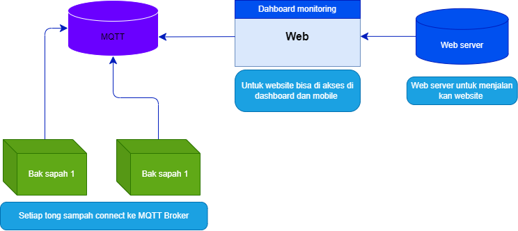
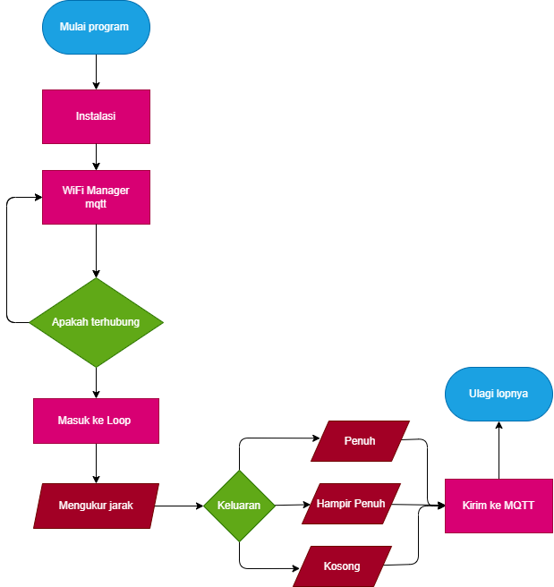

# IoT Tong Sampah Pintar

[Tampilan dashboard](https://nugraa21.github.io/IOT-TONGSAMPAH/web/index.html)
## Instalasi

1. Clone repositori:
   ```bash
   git clone https://github.com/yourusername/IoT-Smart-Trash-Bin.git
 
                 
Proyek ini bertujuan untuk membuat tong sampah pintar yang dapat memantau kapasitasnya dan mengirimkan data ke cloud untuk pengelolaan sampah yang lebih efisien. Tong sampah yang dilengkapi IoT ini menggunakan berbagai sensor untuk mendeteksi tingkat sampah dan memberi notifikasi kepada pengguna saat tong sampah sudah penuh.

## Fitur

- **Deteksi Tingkat Sampah**: Menggunakan sensor ultrasonik untuk mengukur tingkat sampah di dalam tong.
- **Pemantauan Real-time**: Mengirimkan data ke server cloud, sehingga dapat diakses secara real-time.
- **Notifikasi Otomatis**: Memberikan peringatan kepada pengguna saat tong sampah sudah penuh dan perlu dikosongkan.
- **Manajemen Pintar**: Terintegrasi dengan dashboard web untuk melacak dan mengelola banyak tong sampah.
- **Efisiensi Energi**: Dioptimalkan untuk konsumsi daya rendah agar dapat bekerja dengan efisien dalam waktu lama.

## Komponen Hardware

- **ESP32**: Pengendali utama untuk sistem IoT, menangani komunikasi dan pemrosesan.
- **Sensor Ultrasonik**: Mengukur jarak dari bagian atas tong sampah ke sampah di dalamnya, menentukan tingkat kepenuhan.
- **Buzzer**: Memberikan peringatan saat tong sampah penuh.
- **Indikator LED**: Menyala untuk menunjukkan status tong sampah (misalnya, merah jika penuh, hijau jika kosong).
- **Modul WiFi**: Untuk menghubungkan sistem ke internet dan mengirimkan data ke cloud.

## Komponen Software

- **Firmware ESP32**: Ditulis dalam C++ menggunakan Arduino IDE.
- **Layanan Cloud**: Mengirimkan data ke server cloud untuk pemantauan dan penyimpanan real-time.
- **Dashboard Web**: Dashboard interaktif untuk melacak status semua tong sampah yang terhubung.
- **REST API**: Memungkinkan integrasi dengan layanan lain dan solusi smart city.

## Cara Kerja

1. **Deteksi Tingkat Sampah**: Sensor ultrasonik terus-menerus mengukur tingkat sampah dalam tong. Saat sampah mencapai ambang batas tertentu, sistem akan mendeteksi bahwa tong sudah penuh.
   
2. **Transmisi Data**: ESP32 mengirimkan data mengenai status tong sampah (kosong, penuh, atau lebih dari kapasitas) ke server cloud melalui WiFi.

3. **Notifikasi Pengguna**: Jika tong sampah penuh, sistem akan mengirimkan pemberitahuan kepada pengguna melalui dashboard web atau notifikasi seluler.

4. **Dashboard Cloud**: Data ditampilkan di dashboard web, memungkinkan pengguna untuk memantau beberapa tong sampah dan menerima pembaruan real-time mengenai statusnya.

## Diagram 

### Diagram Block 



### Diagram alir 



## Diagram 


## Code 
### Tong sampah 1

```c++
#include <WiFi.h>
#include <PubSubClient.h>

// Konfigurasi WiFi
const char* ssid = "nugra";  // Ganti dengan nama SSID WiFi
const char* password = "081328400060";  // Ganti dengan password WiFi

// Konfigurasi MQTT
const char* mqtt_server = "broker.mqttdashboard.com";
const char* topic = "tong_sampah_1/status";
WiFiClient espClient;
PubSubClient client(espClient);

// Definisikan pin untuk sensor ultrasonik dan buzzer
const int trigPin = 16;  // Pin Trigger
const int echoPin = 4;  // Pin Echo
const int buzzerPin = 5; // Pin buzzer

void setup() {
  Serial.begin(115200);

  // Inisialisasi WiFi
  WiFi.begin(ssid, password);
  while (WiFi.status() != WL_CONNECTED) {
    delay(500);
    Serial.print(".");
  }
  Serial.println("\nWiFi connected");

  // Inisialisasi MQTT
  client.setServer(mqtt_server, 1883);

  // Inisialisasi Pin
  pinMode(trigPin, OUTPUT);
  pinMode(echoPin, INPUT);
  pinMode(buzzerPin, OUTPUT);
}

void loop() {
  if (!client.connected()) {
    reconnect();
  }
  client.loop();

  long distance = measureDistance();

  // Tentukan status berdasarkan jarak
  String status;
  if (distance > 10) {
    status = "Kosong";
    digitalWrite(buzzerPin, LOW);
  } else if (distance > 5 && distance <= 20) {
    status = "Hampir Penuh";
    digitalWrite(buzzerPin, LOW);
  } else if (distance <= 5) {
    status = "Sudah Penuh";
    digitalWrite(buzzerPin, HIGH);
  }

  // Kirim status ke MQTT
  client.publish(topic, status.c_str());
  Serial.println("Status: " + status);

  delay(2000); // Delay untuk pembacaan berikutnya
}

// Fungsi untuk mengukur jarak
long measureDistance() {
  digitalWrite(trigPin, LOW);
  delayMicroseconds(2);
  digitalWrite(trigPin, HIGH);
  delayMicroseconds(10);
  digitalWrite(trigPin, LOW);

  long duration = pulseIn(echoPin, HIGH);
  long distance = duration * 0.034 / 2;
  return distance;
}

// Fungsi untuk reconnect MQTT
void reconnect() {
  while (!client.connected()) {
    if (client.connect("ESP32_TongSampah_1")) {
      client.subscribe(topic);
    } else {
      delay(5000);
    }
  }
}

```
### Tong sampah 2 
```c++
#include <WiFi.h>
#include <PubSubClient.h>

// Konfigurasi WiFi
const char* ssid = "nugra";  // Ganti dengan nama SSID WiFi
const char* password = "081328400060";  // Ganti dengan password WiFi

// Konfigurasi MQTT
const char* mqtt_server = "broker.mqttdashboard.com";
const char* topic = "tong_sampah_2/status";  // Topik untuk tong sampah kedua
WiFiClient espClient;
PubSubClient client(espClient);

// Definisikan pin untuk sensor ultrasonik dan buzzer
const int trigPin = 16;  // Pin Trigger
const int echoPin = 4;   // Pin Echo
const int buzzerPin = 5; // Pin buzzer

void setup() {
  Serial.begin(115200);

  // Inisialisasi WiFi
  WiFi.begin(ssid, password);
  while (WiFi.status() != WL_CONNECTED) {
    delay(500);
    Serial.print(".");
  }
  Serial.println("\nWiFi connected");

  // Inisialisasi MQTT
  client.setServer(mqtt_server, 1883);

  // Inisialisasi Pin
  pinMode(trigPin, OUTPUT);
  pinMode(echoPin, INPUT);
  pinMode(buzzerPin, OUTPUT);
}

void loop() {
  if (!client.connected()) {
    reconnect();
  }
  client.loop();

  long distance = measureDistance();

  // Tentukan status berdasarkan jarak
  String status;
  if (distance > 10) {
    status = "Kosong";
    digitalWrite(buzzerPin, LOW);
  } else if (distance <= 5) {
    status = "Sudah Penuh";
    digitalWrite(buzzerPin, HIGH);
  }

  // Kirim status ke MQTT
  client.publish(topic, status.c_str());
  Serial.println("Status: " + status);

  delay(2000); // Delay untuk pembacaan berikutnya
}

// Fungsi untuk mengukur jarak
long measureDistance() {
  digitalWrite(trigPin, LOW);
  delayMicroseconds(2);
  digitalWrite(trigPin, HIGH);
  delayMicroseconds(10);
  digitalWrite(trigPin, LOW);

  long duration = pulseIn(echoPin, HIGH);
  long distance = duration * 0.034 / 2;
  return distance;
}

// Fungsi untuk reconnect MQTT
void reconnect() {
  while (!client.connected()) {
    if (client.connect("ESP32_TongSampah_2")) {  // ID perangkat untuk tong sampah kedua
      client.subscribe(topic);
    } else {
      delay(5000);
    }
  }
}

```
## Code web / js 

```js
      // Lokasi tong sampah
      const lokasiTongSampah1 = [-7.82062992849643, 110.42654669574745];
    const lokasiTongSampah2 = [-7.820135382837104, 110.42666630956253];

    // Inisialisasi peta
    const map = L.map('map').setView([-7.8204, 110.4266], 16); // Pusat peta

    L.tileLayer('https://{s}.tile.openstreetmap.org/{z}/{x}/{y}.png', {
      attribution: '&copy; <a href="https://www.openstreetmap.org/copyright">OpenStreetMap</a> contributors'
    }).addTo(map);

    // Menambahkan marker untuk tong sampah
    const markerTongSampah1 = L.marker(lokasiTongSampah1, {
      icon: L.divIcon({ className: 'marker-empty', html: '🟢' })
    }).addTo(map)
      .bindPopup('Tong Sampah 1')
      .openPopup();

    const markerTongSampah2 = L.marker(lokasiTongSampah2, {
      icon: L.divIcon({ className: 'marker-empty', html: '🟢' })
    }).addTo(map)
      .bindPopup('Tong Sampah 2');

    // Inisialisasi MQTT
    const client = mqtt.connect('ws://broker.mqttdashboard.com:8000/mqtt');

    client.on('connect', function () {
      console.log('MQTT Connected');
      client.subscribe('tong_sampah_1/status');
      client.subscribe('tong_sampah_2/status');
    });

    client.on('message', function (topic, message) {
      const status = message.toString();
      
      if (topic === 'tong_sampah_1/status') {
        const statusElement = document.getElementById('statusTongSampah1');
        statusElement.textContent = 'Status: ' + status;
        if (status === 'Sudah Penuh') {
          statusElement.classList.add('status-full');
          statusElement.classList.remove('status-empty');
          markerTongSampah1.bindPopup('Tong Sampah 1 Penuh').openPopup();
          markerTongSampah1.setIcon(L.divIcon({ className: 'marker-full', html: '🔴' }));
          playAlertSound();
        } else {
          statusElement.classList.add('status-empty');
          statusElement.classList.remove('status-full');
          markerTongSampah1.setIcon(L.divIcon({ className: 'marker-empty', html: '🟢' }));
        }
      }

      if (topic === 'tong_sampah_2/status') {
        const statusElement = document.getElementById('statusTongSampah2');
        statusElement.textContent = 'Status: ' + status;
        if (status === 'Sudah Penuh') {
          statusElement.classList.add('status-full');
          statusElement.classList.remove('status-empty');
          markerTongSampah2.bindPopup('Tong Sampah 2 Penuh').openPopup();
          markerTongSampah2.setIcon(L.divIcon({ className: 'marker-full', html: '🔴' }));
          playAlertSound();
        } else {
          statusElement.classList.add('status-empty');
          statusElement.classList.remove('status-full');
          markerTongSampah2.setIcon(L.divIcon({ className: 'marker-empty', html: '🟢' }));
        }
      }
    });

    // Fungsi untuk memutar suara alert
    function playAlertSound() {
      const audio = new Audio('pilager.mp3');
      audio.play();
    }
```

## Html 

```html
<!DOCTYPE html>
<html lang="en">
<head>  
    <!-- css framwork  -->
    <link rel="stylesheet" href="https://cdnjs.cloudflare.com/ajax/libs/font-awesome/6.0.0-beta3/css/all.min.css">
    <link rel="stylesheet" href="https://unpkg.com/leaflet@1.7.1/dist/leaflet.css" />
    <!-- ---------- css ---------- -->
    <link rel="stylesheet" href="assets/css/styles.css"> 
    <link rel="stylesheet" href="assets/css/responsif.css">
    <!-- ---------- icon ---------- -->
     <link rel="icon" href="assets/media/icon/code.png">
     <!-- ---------- Meta ---------- -->
    <meta charset="UTF-8">
    <meta name="viewport" content="width=device-width, initial-scale=1.0">
    <!-- ---------- Title ---------- -->
    <title>IOT-SAMPAH</title>
</head>
<body>
<nav>
<!-- ------------------------------------------------------------------------------------------- -->
<div class="container">
    <!-- <div class="map-container"> -->
      <!-- <h1>dat dat dat dat </h1> -->
      <div id="map" class="map-container"></div>
      <!-- </div> -->
  <div class="info">
    <nav 
    style="display: flex;
          justify-content: space-around;
          /* background-color: aliceblue; */
          align-items: center;
    "
    >
      <div 
      style="
        font-size: 20px;
        font-weight: 700;
      "
      class="nav-logo">Nugra21</div>
      <div 
      style="
        display: flex;
        justify-content: space-around;
        gap: 1rem;
        color: aliceblue;
      "
      class="nav-link">
        <div class="link"><a href="#">Daftar</a></div>
        <div class="link"><a href="#">login</a></div>
        <div class="link"><a href="#">chat</a></div>
      </div>
    </nav>
    <h2> Status Tong Sampah</h2>
    <!-- cart -->
    <div class="cart-row">
      <!-- rumah 1 -->
      <div class="cart">
        <div class="cart-data">
          <div class="cart-row-logo">
            <h1> Rumah 1</h1>
            <div class="buttons">
              <button id="light-theme" onclick="location.href='https://maps.app.goo.gl/g2iWwM3xYWAd1wgC7'">Lihat lokasi</button>
          </div>
          </div>
          <div class="cart-alamat">
            <h4>alamat rumah </h4>
            <p>Sekarsuli, Sendangtirto, Kec. Berbah, <br> Kabupaten Sleman, Daerah Istimewa</p>
          </div>
        </div>
        <div class="cart-status">
          <div id="statusTongSampah1" class="status">Menunggu status...</div>
        </div>
      </div>
      <!-- rumah 2 -->
      <div class="cart">
        <div class="cart-data">
          <div class="cart-row-logo">
            <h1> Rumah 2</h1>
            <div class="buttons">
              <button id="light-theme" onclick="location.href='https://maps.app.goo.gl/2zHKCF3R3VQuNYzCA'">Lihat lokasi</button>
          </div>
          </div>
          <div class="cart-alamat">
            <h4>alamat rumah </h4>
            <p>Sekarsuli, Sendangtirto, Kec. Berbah, <br> Kabupaten Sleman, Daerah Istimewa</p>
          </div>
        </div>
        <div class="cart-status">
          <div id="statusTongSampah2" class="status">Menunggu status...</div>
        </div>
      </div>
            <!-- rumah 3 -->
            <div class="cart">
              <div class="cart-data">
                <div class="cart-row-logo">
                  <h1> Rumah 3</h1>
                  <div class="buttons">
                    <button id="light-theme" onclick="location.href=''">Lihat lokasi</button>
                </div>
                </div>
                <div class="cart-alamat">
                  <h4></h4>
                  <p></p>
                </div>
              </div>
              <div class="cart-status">
                <div id="statusTongSampah3" class="status">Belum ada </div>
              </div>
            </div>
      <!--  -->
    </div>
  </div>
  <!--  -->
  <!--  -->
</div>

<!-- ------------------------------------------------------------------------------------------- -->
<!-- js  -->
  <script src="https://code.jquery.com/jquery-3.6.0.min.js"></script>
  <script src="https://unpkg.com/leaflet@1.7.1/dist/leaflet.js"></script>
  <script src="https://unpkg.com/mqtt/dist/mqtt.min.js"></script>
  <script src="https://unpkg.com/leaflet@1.7.1/dist/leaflet.js"></script>
  <script src="https://cdn.jsdelivr.net/npm/mqtt@4.3.7/dist/mqtt.min.js"></script>
  <!-- js  -->
<!-- <script src="assets/js/main.js"></script> -->
 <script>
      // Lokasi tong sampah
      const lokasiTongSampah1 = [-7.82062992849643, 110.42654669574745];
    const lokasiTongSampah2 = [-7.820135382837104, 110.42666630956253];

    // Inisialisasi peta
    const map = L.map('map').setView([-7.8204, 110.4266], 16); // Pusat peta

    L.tileLayer('https://{s}.tile.openstreetmap.org/{z}/{x}/{y}.png', {
      attribution: '&copy; <a href="https://www.openstreetmap.org/copyright">OpenStreetMap</a> contributors'
    }).addTo(map);

    // Menambahkan marker untuk tong sampah
    const markerTongSampah1 = L.marker(lokasiTongSampah1, {
      icon: L.divIcon({ className: 'marker-empty', html: '🟢' })
    }).addTo(map)
      .bindPopup('Tong Sampah 1')
      .openPopup();

    const markerTongSampah2 = L.marker(lokasiTongSampah2, {
      icon: L.divIcon({ className: 'marker-empty', html: '🟢' })
    }).addTo(map)
      .bindPopup('Tong Sampah 2');

    // Inisialisasi MQTT
    const client = mqtt.connect('ws://broker.mqttdashboard.com:8000/mqtt');

    client.on('connect', function () {
      console.log('MQTT Connected');
      client.subscribe('tong_sampah_1/status');
      client.subscribe('tong_sampah_2/status');
    });

    client.on('message', function (topic, message) {
      const status = message.toString();
      
      if (topic === 'tong_sampah_1/status') {
        const statusElement = document.getElementById('statusTongSampah1');
        statusElement.textContent = 'Status: ' + status;
        if (status === 'Sudah Penuh') {
          statusElement.classList.add('status-full');
          statusElement.classList.remove('status-empty');
          markerTongSampah1.bindPopup('Tong Sampah 1 Penuh').openPopup();
          markerTongSampah1.setIcon(L.divIcon({ className: 'marker-full', html: '🔴' }));
          playAlertSound();
        } else {
          statusElement.classList.add('status-empty');
          statusElement.classList.remove('status-full');
          markerTongSampah1.setIcon(L.divIcon({ className: 'marker-empty', html: '🟢' }));
        }
      }

      if (topic === 'tong_sampah_2/status') {
        const statusElement = document.getElementById('statusTongSampah2');
        statusElement.textContent = 'Status: ' + status;
        if (status === 'Sudah Penuh') {
          statusElement.classList.add('status-full');
          statusElement.classList.remove('status-empty');
          markerTongSampah2.bindPopup('Tong Sampah 2 Penuh').openPopup();
          markerTongSampah2.setIcon(L.divIcon({ className: 'marker-full', html: '🔴' }));
          playAlertSound();
        } else {
          statusElement.classList.add('status-empty');
          statusElement.classList.remove('status-full');
          markerTongSampah2.setIcon(L.divIcon({ className: 'marker-empty', html: '🟢' }));
        }
      }
    });

    // Fungsi untuk memutar suara alert
    function playAlertSound() {
      const audio = new Audio('pilager.mp3');
      audio.play();
    }
 </script>
 <!-- js tema opsional -->
<script src="assets/js/tema.js"></script>
<!-- server -->
<script>
    const eventSource = new EventSource('http://nugra21:3001/refresh');
    eventSource.onmessage = () => {
        location.reload();
    };
</script>
</body>
</html>

<!-- Data ! -->
<!-- <div class="container">
    <h1>Nugra.template</h1>
    <p>Template semantik code </p>
    
    <div class="buttons">
        <button id="light-theme">Light Mode</button>
        <button id="dark-theme">Dark Mode</button>
    </div>
</div> -->
```

## Css 

```css
/* Root Variables */
:root {
  --font-family: 'Arial', sans-serif;
  --font-size: 16px;
}

/* Light mode variables */
:root.light-mode {
  --bg-color: #f5f5f5;
  --text-color: #222222;
  --button-bg: #4caf50;
  --button-text: #ffffff;
}

/* Dark mode variables */
:root.dark-mode {
  --bg-color: #121212;
  --text-color: #e0e0e0;
  --button-bg: #ff5722;
  --button-text: #000000;
}

/* General Styles */
a{
  text-decoration: none;
}
body {
  font-family: var(--font-family);
  background-color: #d7ffd9;
  margin: 0;
  padding: 0;
  color: var(--text-color);
}

header {
  background-color: #41c735;
  padding: 10px 0;
  text-align: center;
}

header h1 {
  font-size: 2em;
  text-transform: uppercase;
  color: #ffffff;
  letter-spacing: 2px;
}

/* Container Layout */
.container {
  display: flex;
  /* justify-content: space-around; */
  /* gap: 20px; */
  /* padding-top: 20px; */
  margin: 0;
}

/* Info Section */
.info {
  width: 40%; /* Menyesuaikan ukuran agar map dan cart bisa berdampingan */
  padding: 15px;
  color: #333;
  box-sizing: border-box; /* Agar padding tidak merusak ukuran */
}
.info h2{
  text-align: center;
  align-items: center;
  background-color: #1bd66962;
  padding: 10px;
  border-left: 2px solid black;

}

/* Map Container */
.marker-full {
  box-shadow: 0px 0px 10px rgba(0, 0, 0, 0.687);
  background-color: red;
  color: white;
  border-radius: 50%;
  padding: 5px;
}

.marker-empty {
  box-shadow: 0px 0px 10px rgba(0, 0, 0, 0.687);
  background-color: green;
  color: white;
  border-radius: 50%;
  padding: 5px;
}
.map-container {
  /* width: 75%;  */
  /* height: 830px;  */
  width:120% ; 
  height:100vh ; 
  border-right : 5px solid #7dff93;
  border-bottom : 5px solid #88ff7d;
  /* border-radius: 20px; */
}

/* Status Styles */
.status {
  text-align: center;
  padding: 10px;
  margin-top: 10px;
  background-color: #46c735;
  color: white;
  border-radius: 5px;
  transition: background-color 0.3s ease;
}

.status-full {
  background-color: #ff0000;
}

.status-empty {
  background-color: #2e8b57;
  font-weight: bold;
  color: rgb(255, 255, 255);
}

.status:hover {
  background-color: #1bd669;
}

/* Cart Styles */
.cart-row {
  display: block;
  /* background-color: #f8dbdb; */
  /* padding: 1rem; */
}

.cart {
  cursor: pointer;
  background-color: #fff;
  /* padding: 10px; */
  margin-top: 1rem;
  border-radius: 5px;
  border-top: 2px solid rgb(177, 255, 177);
  box-shadow: 0 0 10px rgba(0, 0, 0, 0.317);
  transition: transform 0.2s ease, box-shadow 0.2s ease;
}

.cart:hover {
  transform: scale(1.05);
  box-shadow: 0 0 20px rgba(0, 0, 0, 0.4);
}

.cart-alamat {
  padding: 5px;
  border-left: 2px solid rgb(206, 255, 177);
  background-color: #ff9c9c23;
}

.cart-row-logo {
  display: flex;
  justify-content: space-between;
}

.cart-row-logo h1 {
  font-size: 1.5rem;
  color: #333;
}

.cart-row-logo button {
  background-color: #227aff;
  color: white;
  border: none;
  padding: 8px;
  border-radius: 5px;
  font-size: 15px;
  transition: background-color 0.3s ease;
}

.cart-row-logo button:hover {
  background-color: #b6b4ff;
}

/* Button Styles */
button {
  background-color: rgb(255, 222, 216);
  color: #000;
  border: none;
  padding: 7px;
  border-radius: 10px;
  font-size: 20px;
  display: flex;
  align-items: center;
  box-shadow: 0 0 10px rgba(0, 0, 0, 0.147);
  transition: background-color 0.3s ease;
}

button:hover {
  background-color: #fff;
  color: rgb(255, 255, 255);
}

button img {
  margin-right: 10px;
}

/* Media Queries */
@media (max-width: 768px) {
  .container {
    flex-direction: column; /* Stack vertically for small screens */
    align-items: center;
    gap: 10px; /* Reduce gap between map and cart */
  }

  .info,
  .map-container {
    width: 100%; /* Take full width on small screens */
    margin-bottom: 20px;
    border-right: none;
    box-shadow: 0px 0px 10px rgba(0, 0, 0, 0.247);
  }

  .info {
    font-size: 16px;
    padding: 10px;
  }

  .info h2 {
    font-size: 20px;
  }

  .map-container {
    height: 400px;
  }

  .cart {
    margin: 5px;
    padding: 5px;
    font-size: 14px;
  }

  .cart-row {
    font-size: 12px;
    padding: 0.5rem;
  }

  .cart-alamat {
    padding: 2px;
  }

  .cart-status {
    padding-top: 5px;
  }
}

```